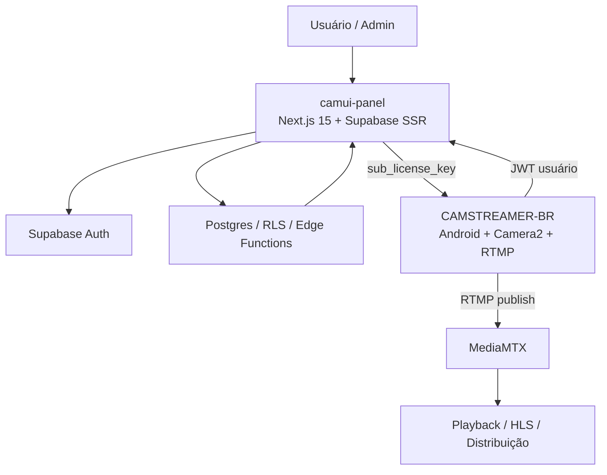
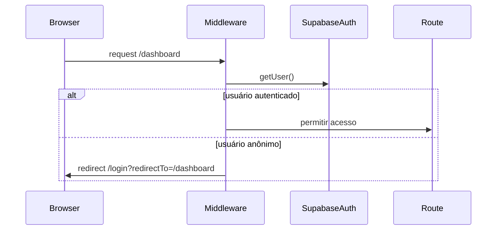
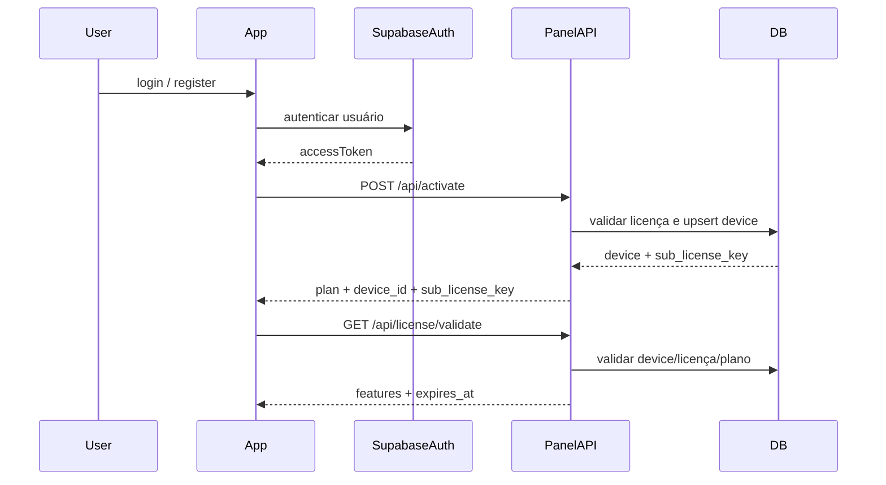
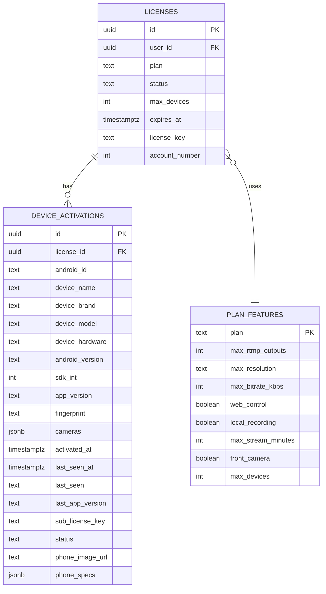
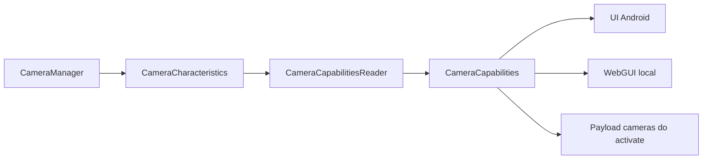
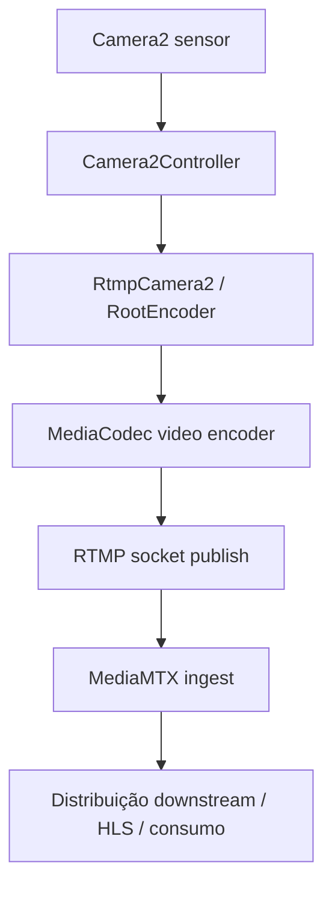
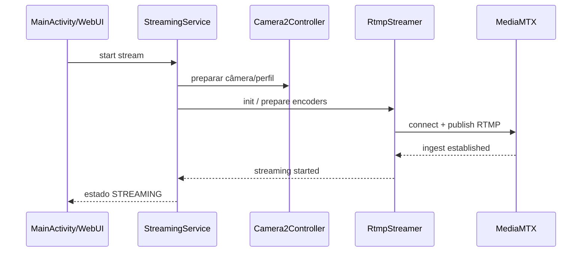

# BLUEPRINT — CAMUI Panel + CAMSTREAMER-BR v5-CAMUI

## Objetivo

Este documento descreve o blueprint técnico consolidado do ecossistema formado por **camui-panel**, **CAMSTREAMER-BR** (branch `v5-CAMUI`) e **MediaMTX**, com foco em **painel web**, **modelo de licenciamento**, **integração Android Camera2**, **fluxo RTMP** e **pontos de evolução do dashboard**. O escopo exclui RTSP e considera apenas o pipeline operacional baseado em **RTMP**.

## Visão arquitetural

O sistema está organizado em três planos principais:

- **Control plane**: `camui-panel`, responsável por autenticação, licenças, inventário de dispositivos, administração e APIs de ativação/validação.
- **Edge device plane**: `CAMSTREAMER-BR`, responsável por captura Camera2, encoding, publicação RTMP, enforcement de plano e WebGUI local.
- **Distribution plane**: `MediaMTX`, responsável por ingest RTMP e redistribuição downstream.



## Repositórios e responsabilidades

### camui-panel

Responsabilidades principais:

- Autenticação via Supabase Auth.
- Dashboard do usuário.
- Dashboard administrativo.
- API de ativação do dispositivo Android.
- API de validação por sub-licença do dispositivo.
- Renderização de inventário de devices e metadados de hardware.
- Orquestração de enriquecimento de dados por Edge Function.

Estrutura de alto nível:

```text
src/
  app/
    page.tsx
    login/
    register/
    auth/callback/
    api/activate/
    api/license/validate/
    (panel)/
      dashboard/
        devices/
        license/
        profile/
        admin/
          users/
          licenses/
          devices/
          plan-features/
  components/
    DashboardShell.tsx
    sidebar/
  lib/
    supabase/
      client.ts
      server.ts
```

### CAMSTREAMER-BR (`v5-CAMUI`)

Responsabilidades principais:

- Login e sessão do usuário.
- Ativação do dispositivo junto ao painel.
- Validação periódica da sub-licença.
- Captura Camera2 com controles avançados.
- Encoding/publish RTMP via RootEncoder.
- Serviço foreground para streaming persistente.
- WebGUI local sobre NanoHTTPD.
- Gate de features conforme plano retornado pelo backend.

Estrutura de alto nível:

```text
app/src/main/java/com/camera2rtsp/
  Camera2Controller.kt
  CameraCapabilities.kt
  CameraCapabilitiesReader.kt
  RtmpStreamer.kt
  StreamingService.kt
  WebControlServer.kt
  WebControlApi.kt
  WebControlAuth.kt
  auth/
    LicenseRepository.kt
    LicenseApiService.kt
    ActivateResponse.kt
    LicenseValidateResponse.kt
    PlanFeatures.kt
    SessionManager.kt
```

### MediaMTX

Responsabilidades principais:

- Receber ingest RTMP vindo do Android.
- Disponibilizar redistribuição downstream.
- Desacoplar captura e distribuição.

## Stack técnico

### Web

- Next.js 15
- React 19
- Supabase SSR
- Supabase JS
- App Router
- Server Components + Route Handlers

### Mobile

- Kotlin
- Android Camera2 API
- RootEncoder / `RtmpCamera2`
- MediaCodec (via biblioteca de streaming)
- NanoHTTPD
- EncryptedSharedPreferences
- Foreground Service

### Backend e dados

- Supabase Auth
- Postgres
- RLS
- Edge Functions

## Autenticação e sessão

### Painel web

O `middleware.ts` cria um `createServerClient` via `@supabase/ssr`, atualiza a sessão via `supabase.auth.getUser()` e protege rotas sensíveis.

Regras observadas:

- Usuário não autenticado acessando `/dashboard` ou `/admin` é redirecionado para `/login`.
- Usuário autenticado acessando `/login` é redirecionado para `/dashboard`.
- O middleware cobre quase toda a aplicação, exceto estáticos e imagens.



### App Android

Fluxo principal:

1. Usuário faz login/cadastro com email e senha.
2. O app recebe `accessToken` do Supabase Auth.
3. O app chama `/api/activate` com os dados do device.
4. O backend gera ou reaproveita `sub_license_key`.
5. O app salva a `sub_license_key` localmente.
6. O app usa `/api/license/validate` para receber o plano e as features operacionais.



## Modelo de dados

A modelagem observada gira em torno de três entidades operacionais centrais:

- `licenses`
- `device_activations`
- `plan_features`

### Relações



### `licenses`

Campos operacionais relevantes inferidos pelo uso nas rotas e páginas:

- `id`
- `user_id`
- `plan`
- `status`
- `max_devices`
- `expires_at`
- `license_key`
- `account_number`

Papel:

- Representa a licença principal da conta.
- Limita o número máximo de devices.
- Determina o plano base usado na resolução de features.

### `device_activations`

Campos adicionados/consumidos:

- `license_id`
- `android_id`
- `device_name`
- `device_brand`
- `device_model`
- `device_hardware`
- `android_version`
- `sdk_int`
- `app_version`
- `fingerprint`
- `cameras`
- `activated_at`
- `last_seen`
- `last_seen_at`
- `last_app_version`
- `sub_license_key`
- `status`
- `phone_image_url`
- `phone_specs`

Papel:

- É a entidade central de inventário de dispositivos.
- Faz o vínculo entre conta/licença e aparelho físico.
- Permite heartbeat operacional via `last_seen_at`.
- Serve como fonte primária do dashboard de dispositivos.

Restrições observadas:

- unicidade por `(license_id, android_id)`
- unicidade de `sub_license_key`
- `status` restrito a estados operacionais como `ACTIVE`, `SUSPENDED`, `REVOKED`

### `plan_features`

Papel:

- Tabela de políticas/gates por plano.
- Fornece contrato operacional consumido pelo Android.
- Centraliza limites como bitrate, resolução, outputs RTMP e recursos de controle.

Campos relevantes:

- `plan`
- `max_rtmp_outputs`
- `max_resolution`
- `max_bitrate_kbps`
- `web_control`
- `local_recording`
- `max_stream_minutes`
- `front_camera`
- `max_devices`

## Segurança, RLS e boundary server-side

A estratégia observada é correta para esse tipo de aplicação:

- O app Android **não escreve diretamente no banco**.
- O backend do painel usa `SUPABASE_SERVICE_ROLE_KEY` para escrita privilegiada.
- A leitura do usuário final é protegida por RLS.
- `device_activations` fica visível apenas para o dono da licença via relação com `licenses.user_id`.

Boundary recomendado:

- `NEXT_PUBLIC_SUPABASE_URL`: exposto ao cliente.
- `NEXT_PUBLIC_SUPABASE_ANON_KEY`: exposto ao cliente/browser.
- `SUPABASE_SERVICE_ROLE_KEY`: **exclusivo do servidor**.

## APIs do painel

## `POST /api/activate`

### Objetivo

Ativar o device Android associado à conta autenticada.

### Autorização

- `Authorization: Bearer <supabase_access_token>`

### Request body esperado

```json
{
  "device_name": "Galaxy S23",
  "device_brand": "Samsung",
  "device_model": "SM-S911B",
  "device_hardware": "qcom",
  "android_version": "14",
  "sdk_int": 34,
  "android_id": "abc123",
  "app_version": "5.0.0",
  "cameras": [
    {
      "id": "0",
      "facing": "back",
      "label": "wide",
      "max_resolution": "3840x2160",
      "max_fps": 60,
      "has_raw": true
    }
  ]
}
```

### Regras de negócio

- Validar o token do usuário.
- Buscar a licença principal da conta.
- Verificar se a licença está ativa.
- Verificar expiração.
- Verificar limite máximo de devices.
- Reutilizar device existente ou fazer upsert por identidade do aparelho.
- Gerar `sub_license_key` única por device.
- Atualizar dados técnicos e heartbeat.
- Disparar sincronização de imagem/especificações do telefone.

### Response esperada

```json
{
  "ok": true,
  "plan": "PRO",
  "max_devices": 5,
  "account_number": 123,
  "device_id": "uuid",
  "sub_license_key": "CAMUI-ABCD-EFGH-IJKL-MNOP",
  "status": "ACTIVE"
}
```

## `GET /api/license/validate`

### Objetivo

Validar a sub-licença operacional do aparelho e devolver features efetivas do plano.

### Autorização

- `Authorization: Bearer <sub_license_key>`

### Regras de negócio

- Localizar o device por `sub_license_key`.
- Verificar status do device.
- Carregar a licença principal associada.
- Verificar status e expiração da licença.
- Carregar `plan_features` pelo plano.
- Atualizar `last_seen_at` de forma assíncrona.
- Responder com payload de autorização operacional.

### Response esperada

```json
{
  "ok": true,
  "plan": "PRO",
  "expires_at": "2026-12-31T00:00:00Z",
  "device_id": "uuid",
  "features": {
    "max_rtmp_outputs": 3,
    "max_resolution": "4K",
    "max_bitrate_kbps": 12000,
    "web_control": true,
    "local_recording": true,
    "max_stream_minutes": 0,
    "front_camera": true,
    "max_devices": 5
  }
}
```

## Edge Function de enriquecimento

A Edge Function `sync-phone-image` é disparada após ativação bem-sucedida do device.

### Papel funcional

- Resolver imagem comercial do aparelho.
- Resolver especificações amigáveis (`phone_specs`).
- Popular o dashboard com informação visual e técnica mais rica.

### Campos alimentados

- `phone_image_url`
- `phone_specs`

### Boas práticas recomendadas

- idempotência por `(device_brand, device_model)`
- cache local/remoto por modelo
- retry com backoff
- logs de falha não bloqueantes

## Dashboard web

## Área do usuário

### `/dashboard/devices`

Características observadas:

- Server Component autenticado.
- Busca licença do usuário.
- Busca `device_activations` da licença.
- Exibe cards com imagem do aparelho, status, Android version e `phone_specs`.
- Calcula presença online/offline a partir de `last_seen_at`.

Dados exibidos atualmente:

- nome/brand/model do device
- Android version
- status da ativação
- indicadores visuais de online/offline
- RAM, câmera, bateria, display, chipset (quando presentes)

### `/dashboard/license`

Papel:

- Exibir plano, status e dados da licença da conta.

### `/dashboard/profile`

Papel:

- Exibir/editar dados básicos do usuário autenticado.

## Área administrativa

Rotas identificadas:

- `/dashboard/admin/users`
- `/dashboard/admin/licenses`
- `/dashboard/admin/devices`
- `/dashboard/admin/plan-features`

Papel:

- administração de usuários
- administração de licenças
- operação de devices
- manutenção da matriz de recursos por plano

## Arquitetura Android detalhada

## Camada de autenticação/licença

### `LicenseRepository`

Responsabilidades:

- login do usuário
- registro do usuário
- chamada de ativação do device
- chamada de validação da sub-licença
- adaptação de payloads entre backend e app

### `SessionManager`

Responsabilidades:

- armazenar `sub_license_key`
- armazenar sessão/autenticação local da WebGUI
- armazenar senha local da WebGUI
- manter `plan` e `features` em memória
- controlar expiração da sessão local

### Dados persistidos localmente

- sub-licença do device
- sessão da WebGUI local
- metadados de autenticação local

### Recomendação técnica

Manter invalidação explícita quando:

- device virar `SUSPENDED`
- device virar `REVOKED`
- licença expirar
- plano mudar e reduzir features

## Camera2 e capabilities

## `Camera2Controller`

Responsabilidades observadas:

- seleção da câmera atual
- controle de exposição manual
- controle de ISO
- controle de white balance
- controle de foco
- controle de zoom
- controle de flash/lanterna
- controle de OIS/EIS
- monitoramento de capture results
- aplicação de requests customizados sobre o pipeline da câmera

Parâmetros operacionais relevantes:

- `currentCameraId`
- `exposureNs`
- `isoValue`
- `manualSensor`
- `whiteBalanceMode`
- `focusDistance`
- `zoomLevel`
- `lanternEnabled`
- `oisEnabled`
- `eisEnabled`
- `flashMode`

### `CameraCapabilities`

Responsabilidades:

- representar o perfil técnico de cada câmera/lente do aparelho

Campos típicos representados:

- `hardwareLevel`
- `facing`
- `name`
- suporte a manual sensor
- suporte a RAW
- suporte a burst
- suporte a logical multi-camera
- ranges de ISO / exposure / focus / zoom / FPS
- resoluções suportadas
- modos AF / AE / AWB
- flash disponível
- OIS disponível
- focal lengths / apertures / sensor metadata

### Fluxo de descoberta



## Streaming RTMP

## `RtmpStreamer`

Responsabilidades:

- encapsular `RtmpCamera2`
- operar com preview (`OpenGlView`)
- operar em background sem preview
- preparar encoders
- iniciar/parar publicação RTMP

## `StreamingService`

Responsabilidades:

- manter o pipeline de streaming vivo fora da Activity
- hospedar instâncias centrais (`cameraController`, `rtmpStreamer`, `httpServer`)
- subir foreground notification
- manter wake lock quando necessário
- permitir reanexação da UI ao serviço

## Fluxo RTMP completo



## Sequência operacional de streaming



## WebGUI local

A WebGUI local opera sobre `NanoHTTPD` e usa autenticação própria com cookie de sessão.

### Componentes centrais

- `WebControlServer`
- `WebControlApi`
- `WebControlAuth`
- `SessionManager`

### Endpoints identificados

| Endpoint | Método | Função |
|---|---|---|
| `/auth/login` | GET / POST | login da WebGUI local |
| `/auth/logout` | GET | logout da WebGUI local |
| `/` | GET | shell HTML da interface local |
| `/style.css` | GET | assets da WebGUI |
| `/app.js` | GET | frontend JS da WebGUI |
| `/status` | GET | status básico |
| `/api/status` | GET | status operacional do stream/câmera |
| `/api/capabilities` | GET | capabilities das câmeras |
| `/api/plan` | GET | plano e features ativas |
| `/api/control` | POST | comandos operacionais de controle |

### Papel arquitetural

- Fornece plano de controle local independente do painel cloud.
- Permite operação LAN com latência baixa.
- Reaproveita `SessionManager` como boundary de autorização local.

## Contratos e pontos de integração

## Integrações já implementadas

### 1. Auth da conta

- `CAMSTREAMER-BR` usa Supabase Auth para identidade do usuário.
- `camui-panel` usa o mesmo auth para dashboard e APIs.

### 2. Ativação do aparelho

- O app envia fingerprint e metadados do device para o painel.
- O painel valida a licença e gera a sub-licença operacional.

### 3. Gate de features

- O app usa a sub-licença para consultar `plan_features` efetivas.
- O plano controla recursos habilitados/desabilitados.

### 4. Inventário técnico

- O app envia `cameras` e metadados Android.
- O painel armazena e renderiza o inventário no dashboard.

### 5. Enriquecimento visual

- A Edge Function resolve imagem e specs do telefone.
- O dashboard utiliza `phone_image_url` e `phone_specs`.

## Integrações recomendadas para próxima fase

### Telemetria operacional

Adicionar os seguintes campos a `device_activations` ou tabela dedicada de telemetry:

- `streaming_now boolean`
- `current_protocol text default 'RTMP'`
- `last_rtmp_url text`
- `stream_started_at timestamptz`
- `last_stream_error text`
- `last_bitrate_kbps int`
- `camera_summary jsonb`
- `app_build_number int`
- `battery_level int`
- `thermal_state text`
- `network_type text`

### Comandos remotos futuros

Criar uma camada de orquestração remota entre painel e devices para comandos como:

- start/stop stream
- alternar lente
- trocar preset de bitrate/resolução
- aplicar perfil de ISO/exposição/WB
- reiniciar sessão local

## Melhorias de dashboard

## Estado atual

O dashboard já serve bem como inventário de devices e visão de licenciamento, mas ainda está mais próximo de um **asset inventory** do que de um **operations console**.

## Objetivo evolutivo

Transformar o dashboard em uma visão operacional de frota, com foco em:

- presença online
- saúde do device
- qualidade do stream
- compliance do plano
- ações remotas e suporte

## Roadmap de refatoração

### P0 — Quick wins

1. Exibir `last_app_version` e badge de versão desatualizada.
2. Exibir resumo estruturado de `cameras` por aparelho.
3. Mostrar plano efetivo e features bloqueadas/liberadas por device.
4. Adicionar filtros por status, plano, online/offline, marca, modelo.
5. Adicionar ordenação por `last_seen_at`, `activated_at`, brand/model.
6. Exibir `sub_license_key` mascarada com ação de copiar no admin.

### P1 — Observabilidade operacional

1. Persistir `streaming_now`.
2. Persistir `stream_started_at`.
3. Persistir `last_rtmp_url`.
4. Persistir `last_bitrate_kbps`.
5. Persistir `last_stream_error`.
6. Exibir timeline de eventos do device.

### P2 — Console de operações

1. Painel de detalhe do device com tabs:
   - Visão geral
   - Câmeras
   - Stream
   - Licença
   - Logs
2. Ações administrativas:
   - suspender
   - revogar
   - reativar
   - reenviar sync de specs/imagem
3. Health score do aparelho.
4. Indicadores de conectividade e estabilidade.

### P3 — Comando remoto e fleet control

1. Remote start/stop stream.
2. Alternância remota de lente/preset.
3. Configuração remota de perfil de encoding.
4. Sincronização de configuração entre painel e app.
5. Histórico auditável de comandos.

## Proposta de UX para o dashboard de devices

### Lista de cards atual → evolução para grid híbrido

Sugestão:

- grid de cards para visão rápida
- tabela detalhada para operação massiva
- drawer lateral para inspeção rápida do device

### Estrutura sugerida da visão principal

```text
[ KPIs ]
- Devices ativos
- Online agora
- Streaming agora
- Com erro recente

[ Filtros ]
- Plano
- Status
- Marca
- Online/offline
- Em streaming

[ Tabela/Grade ]
- Device
- Plano
- Android/App
- Câmeras
- Último heartbeat
- Streaming status
- Saúde
- Ações
```

## Proposta de componentes Next.js

### Server Components

Manter como Server Components:

- páginas de listagem
- carregamento inicial do dashboard
- leitura de inventário/licenças
- métricas agregadas

### Client Components

Usar Client Components apenas onde necessário:

- filtros interativos
- drawers
- ações inline
- polling/tempo real
- toasts de feedback

### Estrutura sugerida

```text
src/app/(panel)/dashboard/devices/
  page.tsx
  loading.tsx
  error.tsx
  components/
    DevicesTable.tsx
    DevicesGrid.tsx
    DeviceFilters.tsx
    DeviceDrawer.tsx
    DeviceStatusBadge.tsx
    DeviceHealthBadge.tsx
    DeviceCapabilities.tsx
```

## Proposta de refatoração de domínio

### Web

Separar melhor por domínio:

```text
src/features/
  auth/
  licenses/
  devices/
  plans/
  admin/
```

Cada feature contendo:

- queries server-side
- actions
- types
- UI components
- mappers

### Android

Separar explicitamente as camadas:

```text
auth/
  repository/
  api/
  session/

camera/
  controller/
  capabilities/
  model/

stream/
  service/
  rtmp/
  state/

webgui/
  server/
  api/
  auth/
```

## Riscos técnicos identificados

### 1. Acoplamento entre estado de stream e UI Android

Sem uma state machine explícita, callbacks de câmera, serviço e RTMP podem gerar inconsistências de estado.

**Recomendação**: introduzir `sealed class StreamingState` com transições explícitas.

### 2. Telemetria ainda limitada no banco

O dashboard atual depende principalmente de `last_seen_at`, o que é útil, mas insuficiente para operar a frota.

**Recomendação**: criar contrato de heartbeat/telemetry com payload periódico.

### 3. Crescimento do admin sem padrão único

A área admin aparenta ter vários componentes específicos de CRUD, o que pode aumentar custo de manutenção.

**Recomendação**: padronizar actions, forms, tables e drawers por domínio.

### 4. Feature gate distribuído

Parte das regras vive em backend, parte em Android e parte implicitamente no dashboard.

**Recomendação**: consolidar `plan_features` como fonte única e derivar UI/controle sempre a partir dela.

## Deploy e operação

## Painel web

Requisitos:

- projeto Supabase ativo
- schema aplicado
- Edge Function implantada
- variáveis de ambiente configuradas
- deploy do Next.js em Vercel ou equivalente

### Variáveis mínimas

```env
NEXT_PUBLIC_SUPABASE_URL=
NEXT_PUBLIC_SUPABASE_ANON_KEY=
SUPABASE_SERVICE_ROLE_KEY=
```

## Android

Requisitos:

- base URL pública do painel
- endpoint RTMP do MediaMTX
- build com permissões Camera2, foreground service e rede

## MediaMTX

Requisitos mínimos:

- endpoint RTMP acessível ao app Android
- política de ingest por path/credenciais conforme ambiente
- distribuição downstream separada do controle/licenciamento

## Estratégia de evolução recomendada

### Fase 1

- consolidar `BLUEPRINT.md`
- padronizar tipos compartilhados de payload entre painel e app
- enriquecer `device_activations`

### Fase 2

- criar telemetria de stream
- reformular `/dashboard/devices`
- criar visão admin orientada a operação

### Fase 3

- introduzir comando remoto seguro
- aproximar painel cloud e WebGUI local
- auditar ações remotas e histórico operacional

## Conclusão operacional

A arquitetura atual já está muito próxima de um produto sólido de **camera streaming fleet management**, porque separa corretamente:

- identidade da conta
- identidade operacional do aparelho
- licenciamento por plano
- captura/encode local
- distribuição via MediaMTX

O principal ganho futuro não está em trocar a base técnica, e sim em **expandir observabilidade, consolidar domínio e elevar o dashboard de inventário para console operacional**.
