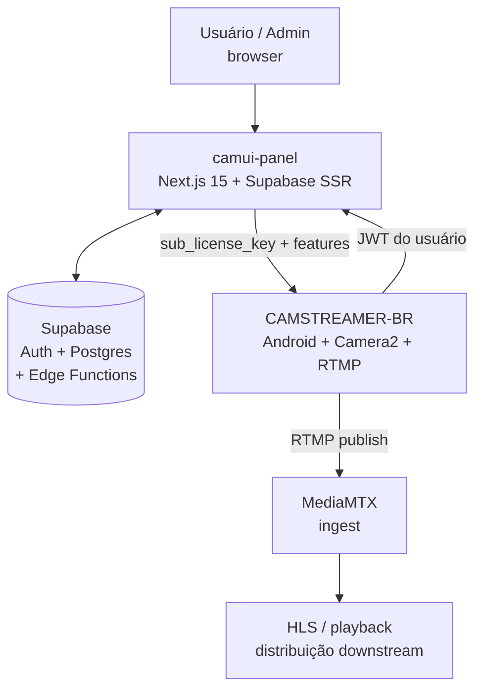
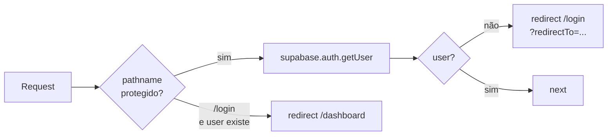
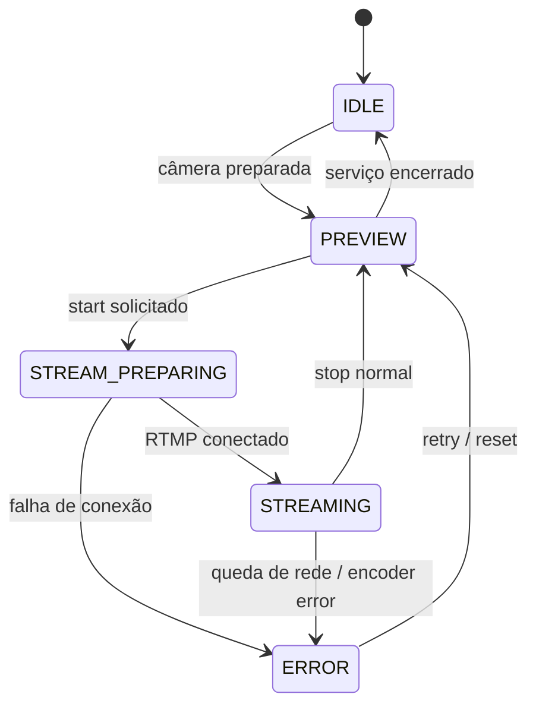
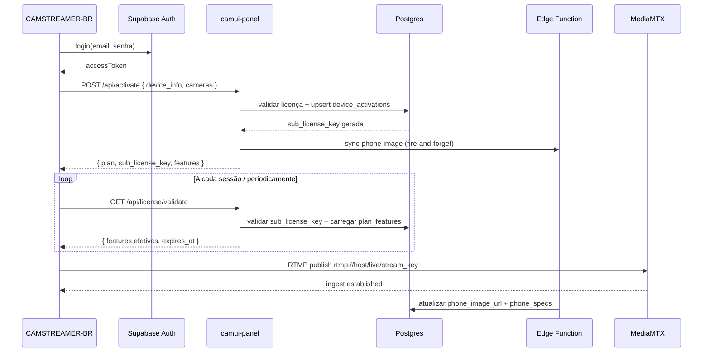

# Architecture — CAMUI Ecosystem

> **Escopo**: visão de sistema, planos técnicos, fluxos principais e decisões arquiteturais.
> Sem RTSP — pipeline operacional exclusivamente via **RTMP**.

---

## Visão geral do sistema

O ecossistema CAMUI é composto por três planos funcionais distintos:

| Plano | Componente | Responsabilidade |
|---|---|---|
| **Control plane** | `camui-panel` | Auth, licenças, inventário, admin, APIs |
| **Edge device plane** | `CAMSTREAMER-BR` | Captura Camera2, encode, RTMP, WebGUI local |
| **Distribution plane** | `MediaMTX` | Ingest RTMP, redistribuição downstream |



---

## camui-panel

### Stack

- Next.js 15 (App Router)
- React 19
- `@supabase/ssr` + `@supabase/supabase-js`
- Server Components por padrão
- Route Handlers para endpoints sensíveis

### Estrutura de rotas

```text
src/app/
  page.tsx                          → landing / redirect
  login/                            → auth pública
  register/                         → auth pública
  auth/callback/                    → callback OAuth/magic link
  api/
    activate/                       → POST: ativação de device Android
    license/validate/               → GET: validação de sub-licença
  (panel)/
    dashboard/
      devices/                      → inventário de dispositivos
      license/                      → licença da conta
      profile/                      → perfil do usuário
      admin/
        users/                      → gestão de usuários
        licenses/                   → gestão de licenças
        devices/                    → gestão de dispositivos
        plan-features/              → matriz de recursos por plano
```

### Camada de dados

```text
src/lib/supabase/
  client.ts     → createBrowserClient (componentes client)
  server.ts     → createServerClient (Server Components e Route Handlers)
```

### Middleware de autenticação



Proteção aplicada a: `/dashboard/**`, `/admin/**`.

---

## CAMSTREAMER-BR v5-CAMUI

### Stack Android

- Kotlin
- Camera2 API (acesso direto via `CameraManager`)
- RootEncoder / `RtmpCamera2` (captura + encode + publish)
- MediaCodec (encoder via biblioteca)
- NanoHTTPD (WebGUI local)
- EncryptedSharedPreferences (AES256-GCM)
- Foreground Service

### Camadas internas

```mermaid
flowchart TD
    A[LoginActivity\nRegisterActivity] --> B[LicenseRepository]
    B --> C[Supabase Auth]
    B --> D[/api/activate]
    B --> E[/api/license/validate]
    E --> F[SessionManager]
    F --> G[StreamingService]
    G --> H[Camera2Controller]
    G --> I[RtmpStreamer]
    G --> J[WebControlServer]
    H --> I
```

### Foreground Service

O `StreamingService` é o núcleo de runtime:

- mantém `Camera2Controller`, `RtmpStreamer` e `WebControlServer` vivos fora da Activity
- administra wake lock
- sobe notification foreground com canal dedicado
- disponibiliza singleton para reanexação da UI

### State machine recomendada



---

## MediaMTX

- Ponto de ingest RTMP vindo do Android
- Separação clara: o app **publica**, o MediaMTX **distribui**
- Downstream via HLS ou outro protocolo conforme configuração
- O painel não interage diretamente com o MediaMTX (sem RTSP no escopo)

---

## Decisões arquiteturais chave

| Decisão | Motivo |
|---|---|
| Android não grava diretamente no banco | Centraliza validação de plano e limite de devices no backend |
| `sub_license_key` por aparelho | Separa identidade da conta da identidade operacional do device |
| Server Components para dashboard | Evita exposição de dados sensíveis no cliente |
| Middleware SSR para auth | Proteção de rotas sem round-trip extra no cliente |
| Foreground Service para stream | Captura não depende da Activity estar visível |
| WebGUI via NanoHTTPD | Controle local em LAN sem depender do painel cloud |
| Edge Function para enriquecimento | Desacopla enriquecimento de metadados do fluxo crítico de ativação |

---

## Variáveis de ambiente

```env
# Público — seguro expor no browser
NEXT_PUBLIC_SUPABASE_URL=
NEXT_PUBLIC_SUPABASE_ANON_KEY=

# Privado — apenas servidor Next.js
SUPABASE_SERVICE_ROLE_KEY=
```

> ⚠️ `SUPABASE_SERVICE_ROLE_KEY` nunca deve aparecer em componentes client, bundle ou logs.

---

## Diagrama completo de sequência — ciclo de vida do device


